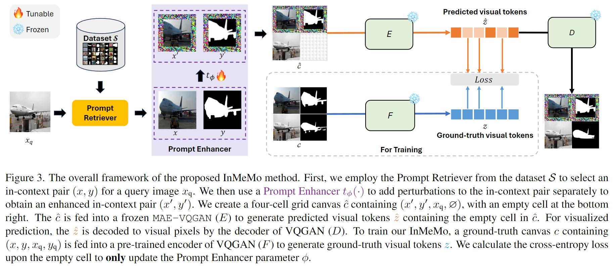
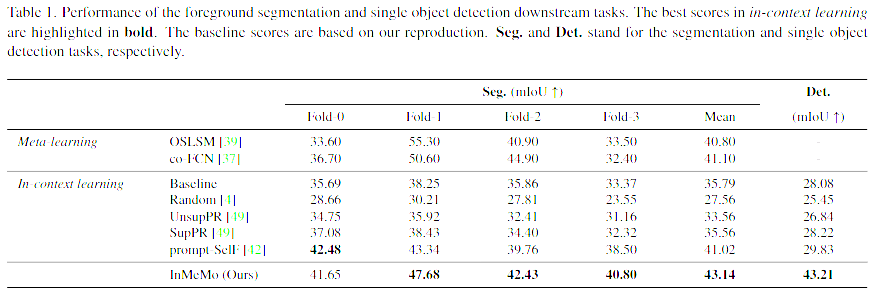

# Instruct Me More! Random Prompting for Visual In-Context Learning (InMeMo)



## Environment Setup
```
conda create -n inmemo python=3.8 -y
conda activate inmemo
```
The PyTorch version needs to be >= 1.8.0, and compatible with the cuda version supported by the GPU.

For NVIDIA GeForce RTX 4090, here is the Installation command:
```
conda install pytorch==1.12.1 torchvision==0.13.1 torchaudio==0.12.1 cudatoolkit=11.6 -c pytorch -c conda-forge
pip install -r requirements.txt
```
## Preparation
### Dataset
Download the Pascal-5<sup>i</sup> Dataset from [Volumetric-Aggregation-Transformer](https://github.com/Seokju-Cho/Volumetric-Aggregation-Transformer), and put it under the ```InMeMo/``` path.
### Pre-trained weights for Large-scale Vision Model
Please follow the [Visual Prompting](https://github.com/amirbar/visual_prompting) to prepare the model.
## Prompt Retriever
[Foreground Sementation Prompt Retriever](./Segmentation.md)

[Single Object Detection Prompt Retriever](./Detection.md)
## Training
### For foreground segmentation:
```
python train_vp_segmentation.py --mode spimg_spmask --output_dir output_samples --device cuda:0 --base_dir ./pascal-5i --batch-size 32 --lr 40 --epoch 100 --scheduler cosinewarm --optimizer Adam --arr a1 --vp-model pad --p-eps 1
```
### For single object detection:
```
python train_vp_detection.py --mode spimg_spmask --output_dir output_samples --device cuda:0 --base_dir ./pascal-5i --batch-size 32 --lr 40 --epoch 100 --scheduler cosinewarm --optimizer Adam --arr a1 --vp-model pad --p-eps 1
```

## Inference
### For foreground segmentation
#### With prompt enhancer
```
python val_vp_segmentation.py --mode spimg_spmask --batch-size 16 --fold 0 --arr a1 --vp-model pad --output_dir visual_examples --save_model_path MODEL_SAVE_PATH
```
#### Without prompt enhancer
```
python val_vp_segmentation.py --mode no_vp --batch-size 16 --fold 0 --arr a1 --output_dir visual_examples
```
### For single object detection
#### With prompt enhancer
```
python val_vp_detection.py --mode spimg_spmask --batch-size 16 --fold 0 --arr a1 --vp-model pad --output_dir visual_examples --save_model_path MODEL_SAVE_PATH
```
#### Without prompt enhancer
```
python val_vp_detection.py --mode no_vp --batch-size 16 --fold 0 --arr a1 --vp-model pad --output_dir visual_examples
```

## Performance



## Visual Examples


## Acknowledgments
Part of the code is borrowed from [Visual Prompting](https://github.com/amirbar/visual_prompting), [visual_prompt_retrieval](https://github.com/ZhangYuanhan-AI/visual_prompt_retrieval), [timm](https://github.com/huggingface/pytorch-image-models), [ILM-VP](https://github.com/OPTML-Group/ILM-VP)
