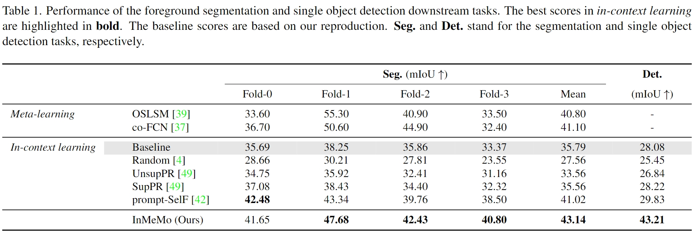

[](https://wacv2024.thecvf.com/)
[](https://arxiv.org/abs/2311.03648)
[](https://arxiv.org/pdf/2311.03648.pdf)
[](https://pytorch.org/get-started/previous-versions/#linux-and-windows-10)
[](https://developer.nvidia.com/cuda-11-6-0-download-archive)
[](https://www.python.org/downloads/release/python-380/)

# Instruct Me More! Random Prompting for Visual In-Context Learning (InMeMo)


## News
 * 11/30/2023 The code repository is publicly available.
 * Code is coming soon...

## Performance



## Visual Examples


## Citation
If you find this work useful, please consider citing us as: 
```
@article{zhang2023instruct,
  title={Instruct Me More! Random Prompting for Visual In-Context Learning},
  author={Zhang, Jiahao and Wang, Bowen and Li, Liangzhi and Nakashima, Yuta and Nagahara, Hajime},
  journal={arXiv preprint arXiv:2311.03648},
  year={2023}
}
```
## Acknowledgments
Part of the code is borrowed from [Visual Prompting](https://github.com/amirbar/visual_prompting), [visual_prompt_retrieval](https://github.com/ZhangYuanhan-AI/visual_prompt_retrieval), [timm](https://github.com/huggingface/pytorch-image-models), [ILM-VP](https://github.com/OPTML-Group/ILM-VP)
